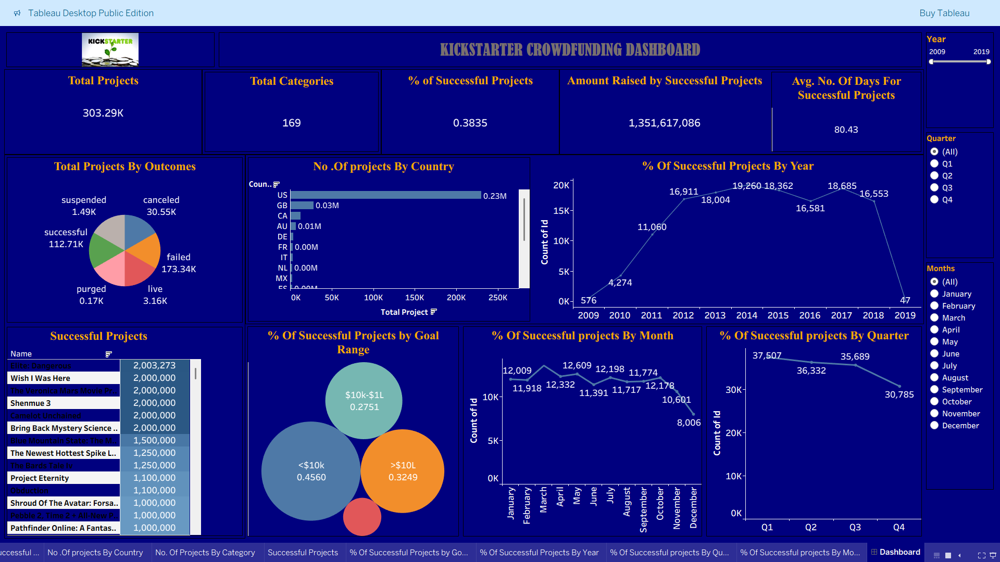

# 🚀 Kickstarter Crowdfunding Analysis Dashboard | Excel | Power BI | Tableau | SQL 

## 📌 Project Description
This project presents an **interactive Tableau dashboard** designed to analyze **Kickstarter crowdfunding projects** across multiple dimensions such as **success rate, funding trends, project outcomes, geographic distribution, and time-based performance**.

The dashboard enables users to explore what factors influence the success of crowdfunding campaigns and provides actionable insights for creators and analysts.

---

## 🎯 Problem Statement
Crowdfunding platforms host thousands of projects every year, but only a fraction succeed.  
This project aims to answer:
- What percentage of Kickstarter projects are successful?
- How does success vary by **year, month, and quarter**?
- Which **goal ranges** have higher success rates?
- Which **countries** contribute the most projects?
- How long do successful projects typically run?

---

## 📊 Key Metrics (KPIs)

| Metric | Value |
|------|------|
| Total Projects | 303.29K |
| Total Categories | 169 |
| % of Successful Projects | 38.35% |
| Amount Raised by Successful Projects | $1.35 Billion |
| Avg. Duration of Successful Projects | 80.43 Days |

---

## 📈 Dashboard Analysis & Insights

### 🔹 Project Outcomes
- Majority of projects fall under **Failed** category
- **112.71K projects** were successful
- Other outcomes include canceled, suspended, live, and purged projects

---

### 🔹 Projects by Country
- **United States** dominates with the highest number of projects
- Followed by **Great Britain, Canada, Australia, and Germany**
- Indicates stronger crowdfunding adoption in developed countries

---

### 🔹 % of Successful Projects by Year
- Strong growth between **2009–2015**
- Peak success observed during **2014–2015**
- Decline seen after **2017**

---

### 🔹 Goal Range vs Success Rate
- Projects with **< $10K goal** have the highest success rate (**45.6%**)
- Success probability decreases as goal amount increases
- High-goal projects (> $100K) are comparatively riskier

---

### 🔹 Monthly Success Trend
- Best-performing months: **March to July**
- Lowest success rate observed in **December**

---

### 🔹 Quarterly Success Trend
- **Q2 and Q3** show higher success rates
- **Q4** has the lowest performance

---

### 🔝 Top Successful Projects
Examples of high-performing campaigns:
- *Elite: Dangerous*
- *Wish I Was Here*
- *The Veronica Mars Movie Project*
- *Shenmue 3*

Ranked based on **amount raised**.

---

## 🎛 Interactive Features
- Year filter (2009–2019)
- Quarter filter (Q1–Q4)
- Month filter (January–December)
- Dynamic visuals and KPI cards

---

## 🛠 Tools & Technologies
- **Tableau Desktop Public Edition**
- **Microsoft Excel / CSV**
- Data Cleaning & Preparation

---

## 📷 Dashboard Preview

---

## 🚀 Conclusion
This project highlights key factors driving successful crowdfunding campaigns, including:
- Lower funding goals
- Optimal launch timing
- Geographic influence

